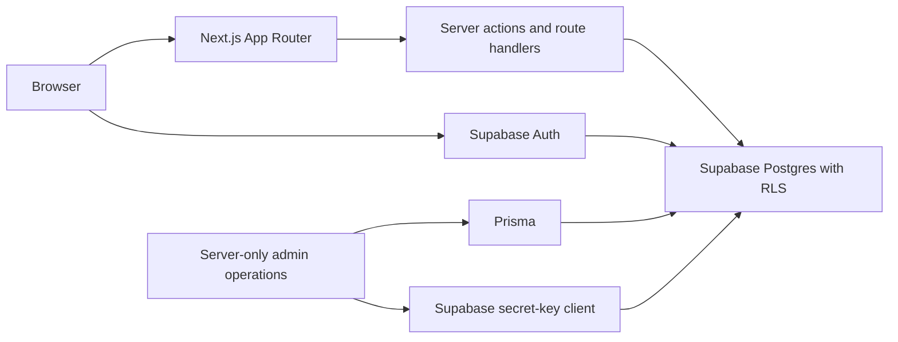

<div align="center">
  <h1>ShiftSentry</h1>
  <p><b>Plan work with confidence. Track shifts, forecast weekly hours, and stay ahead of every limit.</b></p>
  <br />
  <p>
    
    
    
    
    
    
    
  </p>
</div>

<br />

## 📖 Overview

ShiftSentry is a premium, responsive workspace for people balancing one or more jobs. It brings scheduled shifts, completed work, pay, deductions, and weekly limits into one calm view—so users can spot a problem before it becomes one.

<br />

## ✨ Features

| Capability | Description |
| :--- | :--- |
| 💼 **Track multiple jobs** | Keep job-specific colors, pay rates, deductions, and weekly caps organized in one workspace. |
| 📅 **Plan shifts ahead** | Add upcoming work and see it included in projected weekly hours. |
| ⚠️ **Stay under limits** | Get clear warnings at 80%, 90%, and 100% of global or per-job weekly caps. |
| 💰 **Understand earnings** | View gross pay, taxes, deductions, net earnings, and recent earnings history. |
| 🔒 **Use secure sign-in** | Sign in with email, Google, or GitHub through Supabase Auth. |
| 📱 **Work comfortably anywhere** | Use the responsive dashboard, mobile navigation, keyboard-accessible controls, and light or dark themes. |

<br />

## 🛠️ Tech Stack

| Area | Technologies Used |
| :--- | :--- |
| **App Framework** | Next.js 16 App Router, React 19, TypeScript |
| **Styling & Interaction** | Tailwind CSS v4, Radix Select and Dropdown Menu, Inter, Outfit |
| **Data & Auth** | Supabase Auth, PostgreSQL, Row Level Security, `@supabase/ssr`, `@supabase/server` |
| **Server Admin** | Prisma 7 with PostgreSQL |
| **Charts & Dates** | Recharts, `date-fns`, `date-fns-tz` |
| **Validation & Tests**| Zod, Node.js test runner via `tsx` |

<br />

## 🏗️ Architecture



> **Note:** Browser-facing features use Supabase's publishable key and Row Level Security. Prisma and the secret-key client are server-only administrative tools; neither belongs in a browser bundle.

<br />

## 📁 Project Structure

```text
src/
├── app/                    App Router pages, actions, callback, and health route
├── components/             Shared dashboard, navigation, and UI primitives
├── lib/                    Auth, Supabase, validation, calculations, and types
prisma/                     Prisma schema
supabase/migrations/        Immutable timestamped production SQL migrations
.github/workflows/          CI, scheduled audit, and scheduled CodeQL workflows
```

<br />

## 🚀 Local Setup

### Prerequisites

- **Node.js 24** or a compatible runtime supported by Next.js 16
- A **Supabase project** with email, Google, and GitHub sign-in enabled
- **Docker** (only if testing the production image locally)

### 1. Install & Configure

```powershell
git clone https://github.com/pokharelsandeep333-commits/ShiftSentry.git
cd ShiftSentry
npm install
Copy-Item .env.example .env.local
```

Fill in the five placeholders in `.env.local`. The two `NEXT_PUBLIC_SUPABASE_*` values are safe for the browser; `SUPABASE_SECRET_KEY`, `DATABASE_URL`, and `ADMIN_EMAIL_ALLOWLIST` are server-only. Never commit the file.

### 2. Initialize Database

You must apply the database schema to your Supabase project before running the app.

```powershell
npx supabase login
npx supabase link --project-ref <your-project-ref>
npx supabase db push
```

### 3. Configure Supabase Auth

Set the Supabase Auth **Site URL** to `http://localhost:3000` (for local development) and add both application callbacks to the **Redirect URL allow list**:

```text
http://localhost:3000/auth/callback
https://sentry.sandeeppokharel.com.np/auth/callback
```

Enable Email, Google, and GitHub under **Authentication → Sign In / Providers**. Each OAuth provider points back to Supabase's provider callback, `https://<project-ref>.supabase.co/auth/v1/callback`; Supabase then redirects to this app's allowed callback.

### 4. Verify & Run

```powershell
npm run db:generate
npm run test:earnings
npm run test:auth
npx tsc --noEmit
npm run lint
npm run build
npm run dev
```

Open [http://localhost:3000](http://localhost:3000). Without Supabase configuration, the root route intentionally renders a read-only dashboard preview.

<br />

<div align="center">
  <i>Built for clearer weeks, calmer planning, and better work-life boundaries.</i>
</div>
