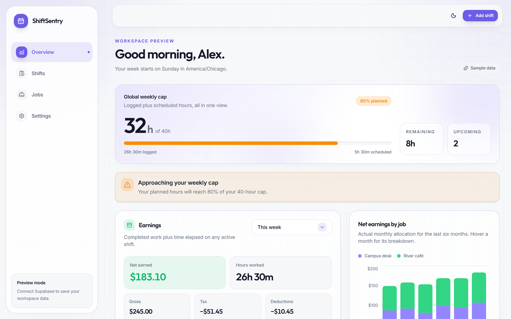
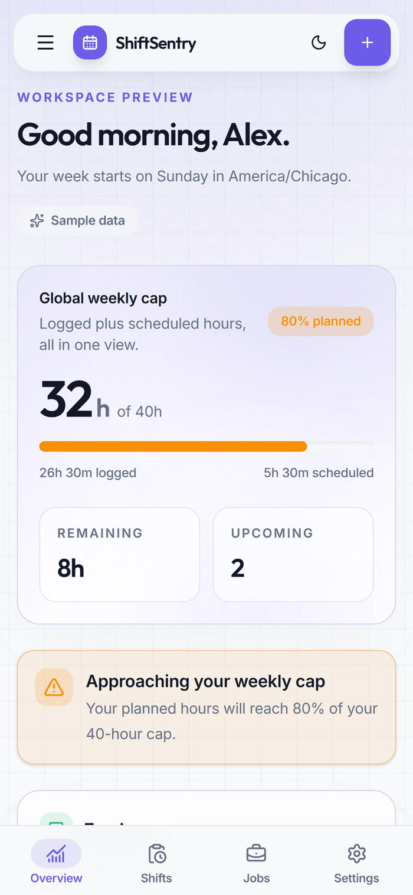
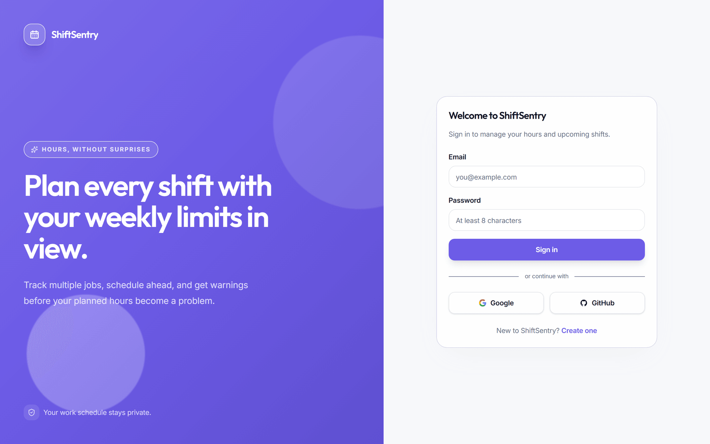
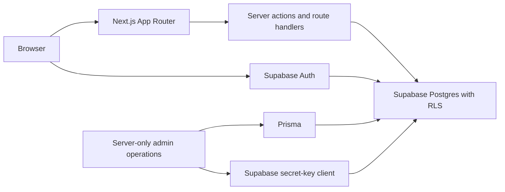

<div align="center">

# ShiftSentry

**Plan work with confidence. Track shifts, forecast weekly hours, and stay ahead of every limit.**

<a href="https://sentry.sandeeppokharel.com.np"></a>

<br /><br />


</div>

<br />

## 📸 Screens

<div align="center">

**Desktop view**



<br /><br />

**Mobile view**



<br /><br />

**Sign in**



</div>

> [!NOTE]
> Captured from the app's built-in preview mode, which renders sample data when no Supabase credentials are present — no real user data is shown.

<br />

## 📖 Overview

ShiftSentry is a responsive workspace for people balancing one or more jobs. It brings scheduled shifts, completed work, pay, deductions, and weekly limits into one calm view—so users can spot a problem before it becomes one.

Hours are counted in **your** time zone and **your** week, not the server's. An overnight shift is split at local midnight and counted across both days, and every total—this week, this month, all time—is accumulated the same way, so the same shift is never worth a different amount in a different view.

<br />

## ✨ Features

| Capability | Description |
| :--- | :--- |
| 💼 **Track multiple jobs** | Keep job-specific colors, pay rates, deductions, and weekly caps organized in one workspace. |
| 📅 **Plan shifts ahead** | Add upcoming work and see it included in projected weekly hours. |
| ⚠️ **Stay under limits** | Get clear warnings at 80%, 90%, and 100% of global or per-job weekly caps. |
| 💰 **Understand earnings** | Gross pay, tax, deductions, and net—filtered by this week, this month, the last 3 or 6 months, year to date, all time, or a custom span of months. |
| 🧾 **Keep history honest** | A shift remembers the rate it was worked at, so a later raise never silently reprices work you already did. |
| 🔒 **Use secure sign-in** | Sign in with email, Google, or GitHub through Supabase Auth. |
| 📱 **Work comfortably anywhere** | Responsive dashboard, mobile navigation, keyboard-accessible controls, and light or dark themes. |

<br />

## 🛠️ Tech Stack

| Area | Technologies Used |
| :--- | :--- |
| **App Framework** | Next.js 16 App Router, React 19, TypeScript |
| **Styling & Interaction** | Tailwind CSS v4, Radix Dropdown Menu, an in-house ARIA listbox, Inter, Outfit |
| **Data & Auth** | Supabase Auth, PostgreSQL, Row Level Security, `@supabase/ssr`, `@supabase/server` |
| **Server Admin** | Prisma 7 with PostgreSQL |
| **Charts & Dates** | Recharts, `date-fns`, `date-fns-tz` |
| **Validation & Tests** | Zod, Node.js test runner via `tsx` |
| **Delivery** | Docker, GitHub Actions, Nginx on EC2 |

<br />

## 🏗️ Architecture



> **Note:** Browser-facing features use Supabase's publishable key and Row Level Security. Prisma and the secret-key client are server-only administrative tools; neither belongs in a browser bundle.

<br />

## 🔐 Security Posture

* **Rules enforced twice.** Weekly caps, earnings snapshots, the tax-plus-deductions ceiling, and a no-overlapping-shifts constraint are enforced in TypeScript *and* independently by Postgres triggers—so a direct authenticated write that skips the app is rejected too.
* **Row Level Security everywhere.** Every user-facing read and write goes through a cookie-bound publishable-key client; the secret key never reaches the browser.
* **Strict CSP.** No external script, style, image, or font hosts—fonts are bundled, not fetched.
* **Guarded pipeline.** Gitleaks secret scanning, CodeQL, a production dependency audit, and a Docker build check all gate `main` before a release is built.

<br />

## 📁 Project Structure

```
src/
├── app/                    App Router pages, actions, callback, and health route
├── components/             Shared dashboard, navigation, and UI primitives
├── lib/                    Auth, Supabase, validation, calculations, and types
prisma/                     Prisma schema
supabase/migrations/        Immutable timestamped production SQL migrations
docs/screenshots/           Images used by this README
.github/workflows/          CI, scheduled audit, and scheduled CodeQL workflows
```

<br />

## 🚀 Local Setup

### Prerequisites

- **Node.js 24** or a compatible runtime supported by Next.js 16
- A **Supabase project** with email, Google, and GitHub sign-in enabled
- **Docker** (only if testing the production image locally)

### 1. Install & Configure

```
git clone https://github.com/pokharelsandeep333-commits/ShiftSentry.git
cd ShiftSentry
npm install
Copy-Item .env.example .env.local
```

Fill in the five placeholders in `.env.local`. The two `NEXT_PUBLIC_SUPABASE_*` values are safe for the browser; `SUPABASE_SECRET_KEY`, `DATABASE_URL`, and `ADMIN_EMAIL_ALLOWLIST` are server-only. Never commit the file.

### 2. Initialize Database

You must apply the database schema to your Supabase project before running the app.

```
npx supabase login
npx supabase link --project-ref <your-project-ref>
npx supabase db push
```

### 3. Configure Supabase Auth

Set the Supabase Auth **Site URL** to `http://localhost:3000` and add the local callback to the **Redirect URL allow list**:

```
http://localhost:3000/auth/callback
```

Enable Email, Google, and GitHub under **Authentication → Sign In / Providers**. Each OAuth provider points back to Supabase's provider callback, `https://<project-ref>.supabase.co/auth/v1/callback`; Supabase then redirects to this app's allowed callback.

### 4. Verify & Run

```
npm run db:generate
npm run test:earnings
npm run test:auth
npx tsc --noEmit
npm run lint
npm run audit:production
npm run build
npm run dev
```

Open [http://localhost:3000](http://localhost:3000).

These are the same checks the pipeline runs on every pull request:

<a href="https://github.com/pokharelsandeep333-commits/ShiftSentry/actions/workflows/ci.yml"></a>

> [!TIP]
> Without Supabase configuration the root route intentionally renders a read-only dashboard preview with sample data, so the app boots and is browsable before you have any credentials.

<br />

<div align="center">
  <i>Built for clearer weeks, calmer planning, and better work-life boundaries.</i>
</div>
