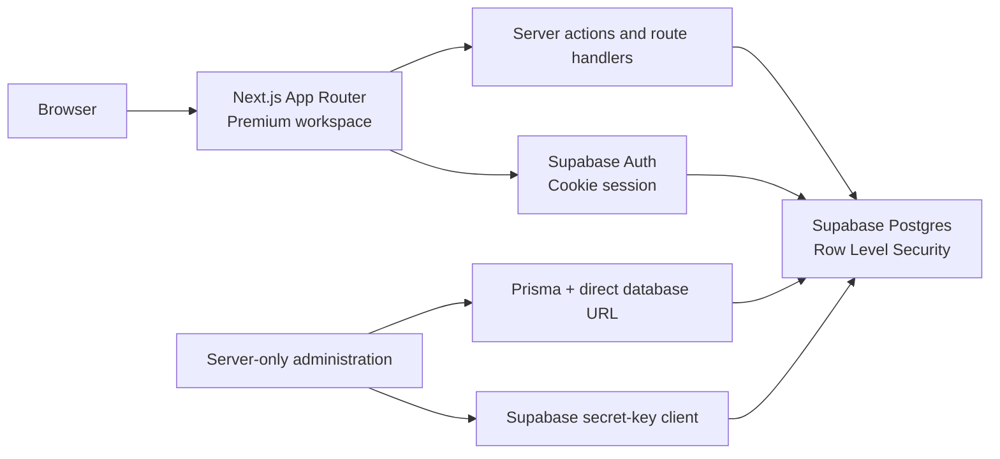

<h1 align="center">ShiftSaaS</h1>

<p align="center">
  Plan work with confidence. Track shifts, forecast weekly hours, and stay ahead of every limit.
</p>

<p align="center">
  
  
  
  
  
  
  
  
</p>

<br />

## 📖 Overview

ShiftSaaS is a premium, responsive workspace for people balancing one or more jobs. It brings scheduled shifts, completed work, pay, deductions, and weekly limits into one calm view—so users can spot a problem before it becomes one.

The app is intentionally product-focused: polished interactions, accessible controls, and practical safeguards without changing the user's work routine.

## ✨ What ShiftSaaS Helps You Do

| Capability | How it helps |
| --- | --- |
| **Track multiple jobs** | Keep job-specific colors, pay rates, deductions, and weekly caps organized in one workspace. |
| **Plan shifts ahead** | Add upcoming work and see it included in projected weekly hours. |
| **Stay under limits** | Get clear warnings at 80%, 90%, and 100% of global or per-job weekly caps. |
| **Understand earnings** | View gross pay, taxes, deductions, net earnings, and recent earnings history. |
| **Use secure sign-in** | Sign in with email, Google, or GitHub through Supabase Auth. |
| **Work comfortably anywhere** | Use the responsive dashboard, mobile navigation, keyboard-accessible controls, and light or dark themes. |

## 🛠️ Tech Stack

| Area | Technology |
| --- | --- |
| App framework | Next.js 16 App Router, React 19, TypeScript |
| Styling and interaction | Tailwind CSS v4, Motion, Radix Select, Inter, Outfit |
| Data and authentication | Supabase, Row Level Security, `@supabase/server` |
| Server administration | Prisma 7 with PostgreSQL |
| Charts and dates | Recharts, date-fns, date-fns-tz |
| Validation and tests | Zod, Node.js test runner via `tsx` |
| Deployment | Docker, EC2-compatible standalone build |

## 🏗️ Architecture



Browser-facing features and user server actions operate through Supabase and its row-level security policies. Prisma and the secret-key Supabase client are reserved for trusted server-side administration; neither belongs in a browser bundle.

## 📁 Project Structure

```text
src/
├── app/                    # App Router pages, server actions, auth callbacks
│   ├── admin/              # Protected administration workspace
│   ├── jobs/               # Job and pay configuration
│   ├── login/              # Email, Google, and GitHub authentication
│   ├── settings/           # Personal weekly-limit preferences
│   └── shifts/             # Shift logging and planning
├── components/
│   ├── dashboard/          # Dashboard views and charts
│   └── ui/                 # Shared accessible UI primitives
└── lib/                    # Auth, validation, calculations, Supabase, types

prisma/                     # Prisma schema and configuration
supabase/migrations/        # Immutable, timestamped Supabase SQL migrations
public/                     # Static assets
```

## 🚀 Local Setup

### Prerequisites

- Node.js 24 or a compatible runtime supported by Next.js 16
- A Supabase project with email, Google, and GitHub sign-in enabled
- Docker (optional, for production-image testing)

### 1. Install dependencies

```bash
npm install
```

### 2. Configure environment variables

Copy the template and replace only the placeholder values:

```powershell
Copy-Item .env.example .env.local
```

`.env.local` requires the Supabase project URL, the modern publishable key, the server-only secret key, a direct PostgreSQL `DATABASE_URL`, and an initial administrator email allowlist. Never commit this file or expose its values in client code.

### 3. Apply the database schema

For a new database, apply every SQL file in `supabase/migrations/` in timestamp order:

```text
202608200001_initial_schema.sql
202608200002_earnings_tracking.sql
202608200003_security_auth_hardening.sql
```

These Supabase SQL files are the migration source of truth. Do not run `prisma migrate`, rerun an applied migration, or apply the initial migrations to a database that already has the schema.

### 4. Configure Supabase Auth

In Supabase, set the Site URL to `http://localhost:3000` and allow this application callback:

```text
http://localhost:3000/auth/callback
```

Enable Email, Google, and GitHub under **Authentication → Sign In / Providers**. The Google and GitHub OAuth applications must use Supabase's provider callback, `https://<project-ref>.supabase.co/auth/v1/callback`; the ShiftSaaS callback stays in the Supabase redirect allowlist.

### 5. Generate, test, and start

```bash
npm run db:generate
npm run test:earnings
npm run dev
```

Open [http://localhost:3000](http://localhost:3000). Without Supabase configuration, the root route intentionally renders a read-only dashboard preview; authenticated pages require Supabase.

## 🧪 Verification

Run the full project check before opening a pull request:

```bash
npm run test:earnings
npx tsc --noEmit
npm run lint
npm run build
```

## 🔐 Security and Data Boundaries

- Row Level Security protects user-facing Supabase data access.
- The proxy refreshes Supabase's cookie-based session before protected server-rendered pages use it.
- Admin access is checked both by the proxy and again inside privileged routes and actions.
- `SUPABASE_SECRET_KEY`, `DATABASE_URL`, and Prisma stay server-only.
- Applied SQL migrations are immutable. Create a new timestamped migration for future schema changes.

## 🐳 Docker and EC2 Deployment

The production image receives only the two browser-safe `NEXT_PUBLIC_SUPABASE_*` values during its build. Keep `SUPABASE_SECRET_KEY`, `DATABASE_URL`, and administrator configuration in the server runtime environment; never bake them into an image.

Build and run the production container locally:

```bash
docker build -t shiftsaas .
docker run --env-file .env.local -p 3000:3000 shiftsaas
```

For the existing Cloudflare and shared-Nginx EC2 host, the live configuration source is `/home/ubuntu/sandeepcloud/docker-compose.yml` and `/home/ubuntu/sandeepcloud/nginx.conf`. ShiftSaaS joins that shared Docker network without exposing port 3000; the existing Nginx container terminates HTTPS and Watchtower updates the private image.

---

Built for clearer weeks, calmer planning, and better work-life boundaries.
